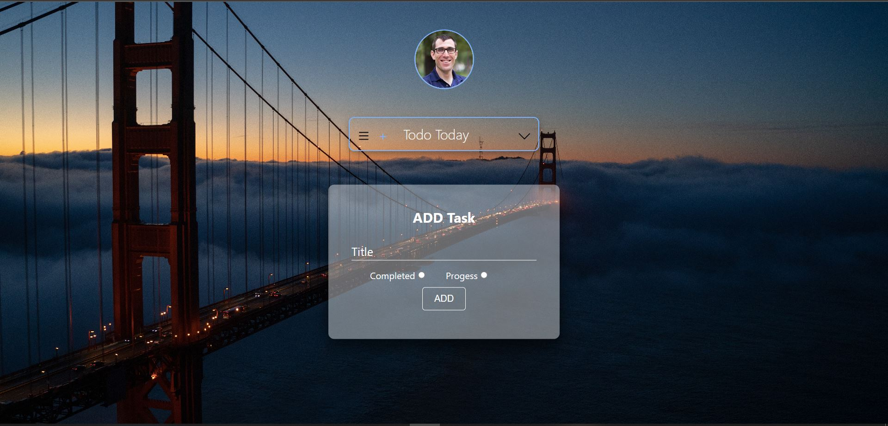
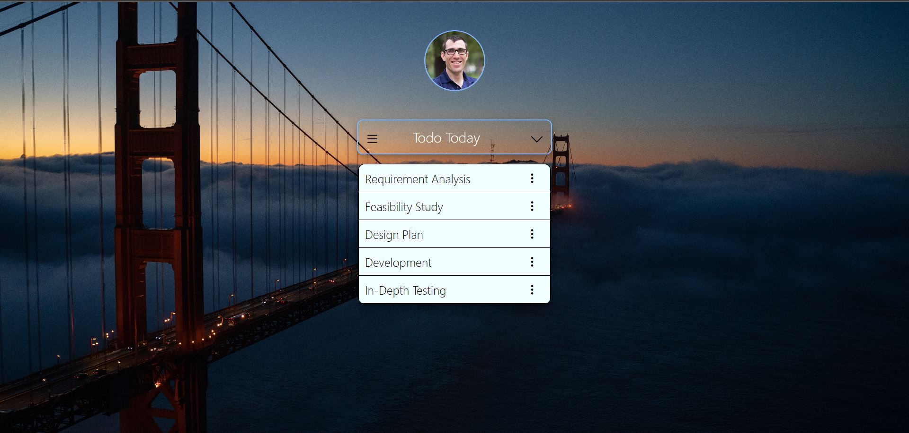
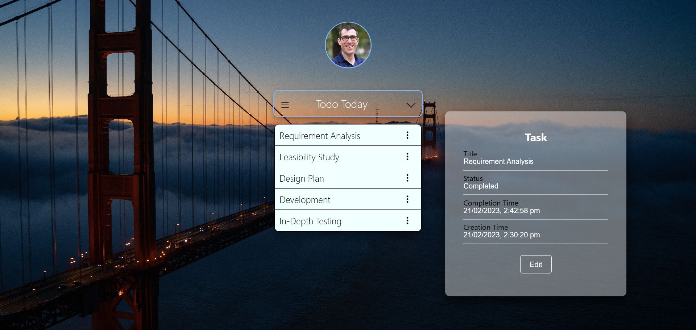

# Todo Application
ToDo Application is build using Express, Nodejs, Reactsjs and MongoDB.
Application contain multiple functionalities.
1. Add Task.
2. Edit Task.
3. Delete Task.
User Interface of Application is intractive.
## Screenshots




## Run Locally

Clone the project

```bash
  git clone https://link-to-project
```

Go to the project directory

```bash
  cd my-project
```

Install dependencies

```bash
  npm install
```

Start the server

```bash
  npm run start
```
## Demo
https://youtu.be/P5Cxjku0t50
